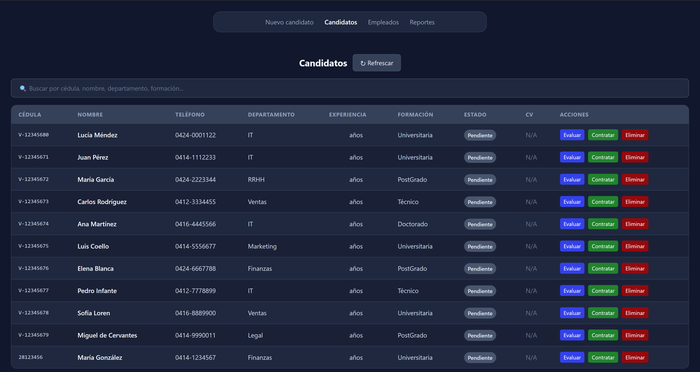
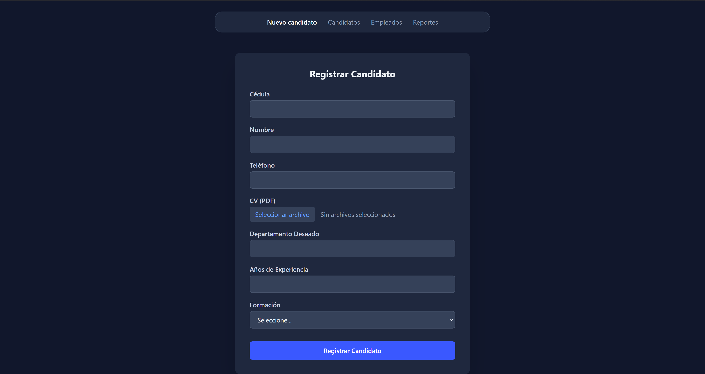
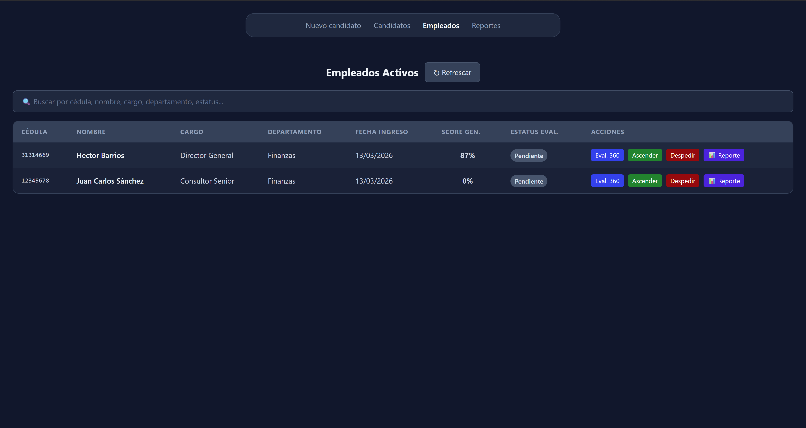
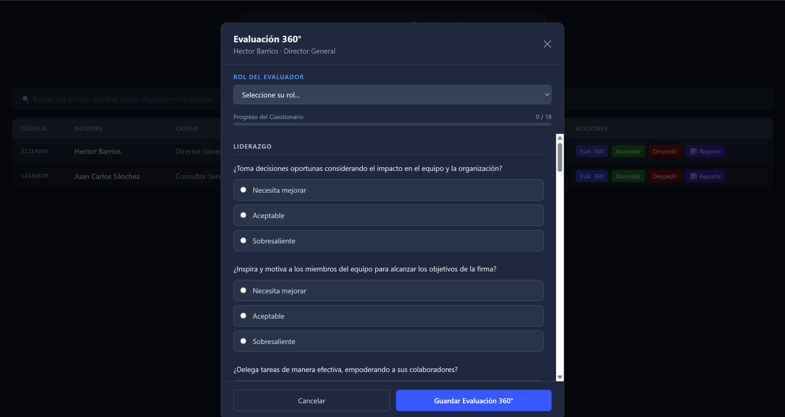
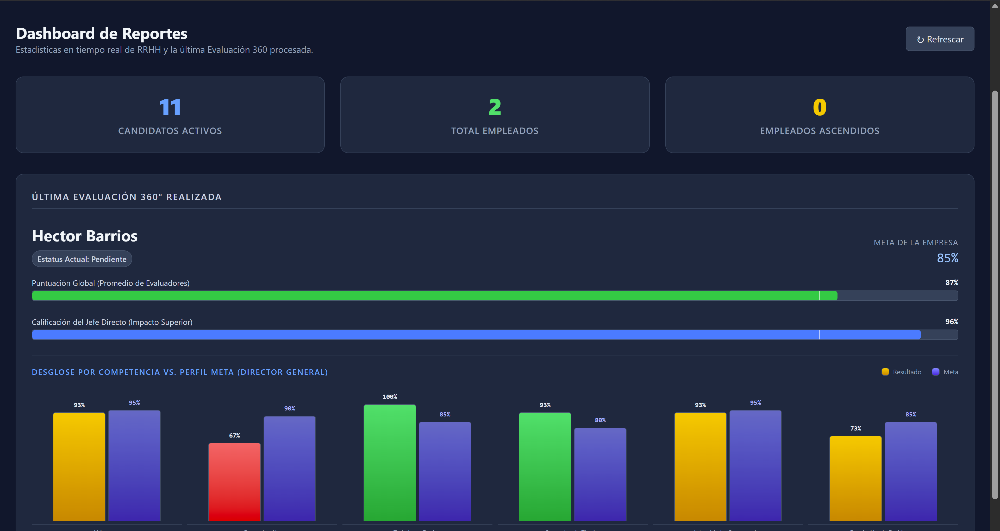
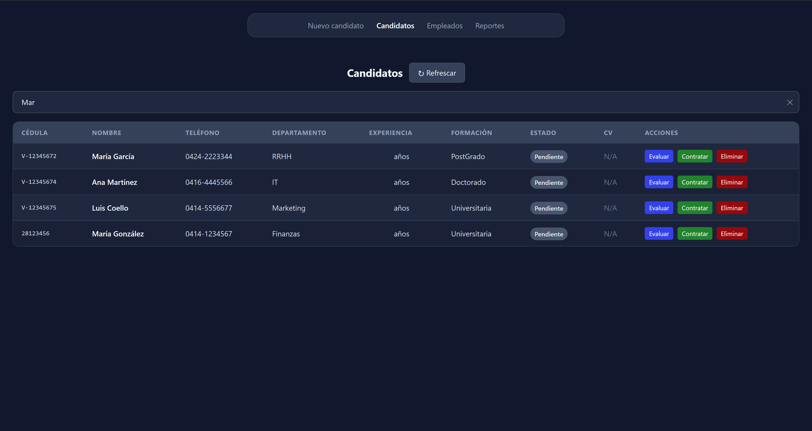

# SIA-Premium: Sistema Integral de Ascensiones 🚀
> Software de RRHH para **Premium Consultores** que automatiza el ciclo completo de gestión de talento: reclutamiento, evaluación de ingreso, contratación, evaluación 360°, ascenso/despido y reportes ejecutivos con análisis por competencia.

![Imagen anexo — Vista general del Dashboard de Reportes con barras verticales por competencia]

---

## 📋 Tabla de Contenidos
- [Descripción](#-descripción)
- [Funcionamiento](#-funcionamiento-fines-académicos)
- [Instalación](#%EF%B8%8F-instalación)
- [Visuales](#-visuales)
- [Uso](#-uso)
- [Estructura del Proyecto](#-estructura-del-proyecto)
- [Tecnologías](#%EF%B8%8F-tecnologías)
- [Licencia y Autores](#-licencia-y-autores)

---

## 💡 Descripción

**SIA-Premium** (Sistema Integral de Ascensiones) es una aplicación web desarrollada para la empresa ficticia *Premium Consultores*, como caso de estudio académico en la asignatura de Sistemas de Operación.

### Problema que resuelve
En muchas organizaciones, las decisiones de ascenso y despido se toman de forma subjetiva, sin métricas claras ni evaluaciones estandarizadas. Esto puede llevar a promover empleados técnicamente competentes pero con graves deficiencias en habilidades blandas (como el caso de *Juan Carlos Sánchez*), o a ignorar talento con alto potencial de liderazgo.

### Solución
SIA-Premium implementa un flujo automatizado y objetivo que incluye:

- **Evaluación de Ingreso (Candidatos):** 10 preguntas categorizadas que miden aptitud técnica, agilidad mental y aporte de valor antes de la contratación.
- **Evaluación 360° (Empleados):** 18 preguntas en 6 competencias clave, evaluadas por múltiples roles (Superior, Colega, Subordinado, Autoevaluación, Cliente).
- **Motor de Reglas Automatizado:** El sistema calcula automáticamente el estatus del empleado (Ascendido / Revisado / Despedido) según umbrales configurables, incluyendo **Red Flags** como bajo rendimiento en Trabajo en Equipo.
- **Perfil Meta por Cargo:** Comparación visual del desempeño real vs. las metas esperadas para el cargo de Director General por cada competencia.
- **Dashboard de Reportes:** Estadísticas en tiempo real, gráficos de barras horizontales (resumen) y verticales en pares (desglose por competencia vs. meta).

---

## 🤔 Funcionamiento (Fines Académicos)

### Flujo del Usuario en el Sistema

```
Candidato → Evaluación de Ingreso → Contratación → Empleado → Evaluación 360° → Decisión → Reportes
```

#### 1. Registro de Candidato
El reclutador ingresa los datos del candidato (cédula, nombre, departamento deseado, formación, experiencia) y opcionalmente sube su CV en formato PDF a Supabase Storage.

#### 2. Evaluación de Ingreso
Se presenta un cuestionario de **10 preguntas** (9 de opción múltiple + 1 abierta de "Aporte de Valor"). El sistema calcula un **score de compatibilidad** desglosado por categoría y clasifica al candidato como:
- ✅ **Recomendado** (≥ 75%)
- ⚠️ **En Observación** (50-74%)
- ❌ **No Recomendado** (< 50%)

#### 3. Contratación
Al contratar un candidato evaluado, sus datos se **transfieren** automáticamente de la tabla `candidatos` a la tabla `empleado`, y su registro como candidato se elimina.

#### 4. Evaluación 360°
El sistema presenta **18 preguntas** divididas en **6 competencias**:

| Competencia | Preguntas | Enfoque |
|---|---|---|
| Liderazgo | 3 | Toma de decisiones, delegación, visión |
| Comunicación | 3 | Claridad, escucha activa, retroalimentación |
| Trabajo en Equipo | 3 | Colaboración, empatía, resolución grupal |
| Competencia Técnica | 3 | Dominio técnico, actualización, productividad |
| Resolución de Problemas | 3 | Análisis, creatividad, decisiones bajo presión |
| Integridad y Compromiso | 3 | Ética, lealtad, cumplimiento de metas |

Cada pregunta se responde en una escala de 5 niveles: *Necesita mejorar (1)* → *Sobresaliente (5)*.

El evaluador selecciona su **rol** antes de evaluar (Superior, Colega, Subordinado, Autoevaluación, Cliente), lo que permite múltiples evaluaciones por diferentes perspectivas que se acumulan en el historial del empleado.

#### 5. Motor de Decisión Automatizado
Tras la evaluación, el sistema calcula:
- **Puntuación global** (promedio ponderado de todas las evaluaciones)
- **Estatus automático:**
  - 🟢 **Ascendido** → puntuación ≥ 85%
  - 🟡 **Revisado** → puntuación entre 65-84%, o contiene una **Alerta de Actitud** (Trabajo en Equipo < 50%)
  - 🔴 **Despedido** → puntuación < 65%

> **🚩 Red Flag de Premium Consultores:** Si un empleado obtiene ≥ 85% global pero < 50% en Trabajo en Equipo, se bloquea el ascenso automático y se marca como "Mantener Posición (Alerta de Actitud)". Este es el caso diseñado para *Juan Carlos Sánchez*.

#### 6. Dashboard de Reportes
El Dashboard presenta:
- **3 tarjetas de estadísticas:** candidatos activos, empleados totales, ascendidos
- **Barras horizontales:** puntuación global y calificación del jefe directo
- **Barras verticales en pares:** desglose por competencia del empleado vs. perfil meta de Director General
- **Color dinámico:** verde (cumple meta), amarillo (≥75% de la meta), rojo (por debajo)

#### 7. Búsqueda Inteligente
Ambas tablas (Candidatos y Empleados) incluyen un filtro de búsqueda que consulta una **función RPC de PostgreSQL** (`buscar_candidatos`, `buscar_empleados`) para búsquedas parciales y case-insensitive en múltiples campos simultáneamente.

---

## 🛠️ Instalación

### Pre-requisitos
- [Node.js](https://nodejs.org/) v18 o superior
- [npm](https://www.npmjs.com/) (incluido con Node.js)
- Cuenta en [Supabase](https://supabase.com/) (o instancia local)

### Pasos

```bash
# 1. Clonar el repositorio
git clone https://github.com/Hector69777/Software-de-RRHH--contrataci-n--despido--ascenso-.git
cd "Software de RRHH (contratación, despido, ascenso)"

# 2. Instalar dependencias del frontend
cd app
npm install

# 3. Configurar la conexión a Supabase
#    Editar el archivo app/src/lib/backend/supabase.js con tu URL y Anon Key
```

### Configurar la Base de Datos

1. En el SQL Editor de Supabase, ejecutar `sql/schema.sql` para crear las tablas.
2. Ejecutar `sql/busqueda_inteligente.sql` para crear las funciones de búsqueda RPC.
3. Agregar manualmente las columnas adicionales (si no están en schema.sql):

```sql
-- Columnas adicionales en la tabla empleado
ALTER TABLE empleado ADD COLUMN IF NOT EXISTS puntuacion_general NUMERIC DEFAULT 0;
ALTER TABLE empleado ADD COLUMN IF NOT EXISTS respuestas_evaluacion360 JSONB;
ALTER TABLE empleado ADD COLUMN IF NOT EXISTS salario NUMERIC DEFAULT 0;
ALTER TABLE empleado ADD COLUMN IF NOT EXISTS revisado TEXT DEFAULT 'Pendiente' 
    CHECK (revisado IN ('Pendiente', 'Revisado', 'Ascendido', 'Despedido'));
ALTER TABLE empleado ADD COLUMN IF NOT EXISTS fecha_ultima_evaluacion TIMESTAMPTZ DEFAULT NULL;

-- Columna de estado en candidatos
ALTER TABLE candidatos ADD COLUMN IF NOT EXISTS estado TEXT DEFAULT 'Pendiente';
```

### Ejecutar en desarrollo

```bash
cd app
npm run dev
# Abre http://localhost:5174 en tu navegador
```

---

## 📸 Visuales

### Vista de Candidatos


### Evaluación de Ingreso


### Vista de Empleados


### Evaluación 360° 


### Dashboard de Reportes


### Búsqueda Inteligente


---

## 🚀 Uso

### Flujo básico de operación

```
1. Navegar a "Nuevo Candidato" → Registrar datos + CV
2. Ir a "Candidatos" → Click en "Evaluar" → Responder 10 preguntas → Guardar
3. Click en "Contratar" → Asignar cargo y salario
4. Ir a "Empleados" → Click en "Eval. 360" → Seleccionar rol → Responder 18 preguntas → Guardar
5. Según el resultado:
   - "Ascendido" → Click en "Ascender" → Asignar nuevo cargo/salario
   - "Despedido" → Click en "Despedir" → Confirmar eliminación
6. Click en "📊 Reporte" → Ver dashboard detallado del empleado
7. Ir a "Reportes" → Ver estadísticas generales y desglose por competencia
```

### Búsqueda rápida
Escribir cualquier término en la barra de búsqueda que aparece arriba de las tablas de Candidatos o Empleados. La búsqueda es **parcial** y **case-insensitive**:
- `"Juan"` → encuentra "Juan Carlos Sánchez"
- `"Finanzas"` → filtra por departamento
- `"Ascendido"` → filtra empleados por estatus

---

## 📁 Estructura del Proyecto

```
Software de RRHH/
├── anexos/                           # Screenshots para documentación y README
├── app/                              # Aplicación React (Vite + TypeScript)
│   ├── src/
│   │   ├── components/
│   │   │   ├── CandidatesTable.tsx    # Tabla de candidatos con búsqueda inteligente
│   │   │   ├── EmployeesTable.tsx     # Tabla de empleados con búsqueda y reporte individual
│   │   │   ├── EvaluationModal.tsx    # Modal de evaluación de ingreso
│   │   │   ├── Evaluation360Modal.tsx # Modal de evaluación 360° por competencias
│   │   │   ├── ReportsDashboard.tsx   # Dashboard de reportes con gráficos comparativos
│   │   │   ├── NavBar.tsx             # Barra de navegación principal
│   │   │   └── NewCandidateForm.tsx   # Registro de nuevos candidatos (Reclutamiento)
│   │   ├── lib/backend/
│   │   │   ├── api-candidatos.js      # Lógica de candidatos (CRUD + búsqueda RPC)
│   │   │   ├── api-empleados.js       # Lógica de empleados (Puntajes + Estatus + RPC)
│   │   │   ├── api-reportes.js        # Lógica de estadísticas y perfil meta
│   │   │   ├── bancoPreguntas.js      # 10 preguntas de ingreso
│   │   │   ├── bancoPreguntas360.js   # 18 preguntas de desempeño 360°
│   │   │   ├── supabase.js            # Inicialización del cliente Supabase
│   │   │   └── config.js              # Gestión de URLs y Keys (Local/Nube)
│   │   ├── supabase/
│   │   │   └── index.ts               # Puente TypeScript (Interfaz Backend JS ↔ UI)
│   │   ├── routes/                    # Páginas y vistas de la aplicación
│   │   └── App.tsx                    # Componente raíz y Router
│   └── vite.config.ts                # Configuración de compilación y Tailwind v4
├── sql/
│   ├── schema.sql                     # Definición de tablas y constraints
│   ├── seed.sql                       # Datos iniciales para pruebas
│   └── busqueda_inteligente.sql       # Funciones RPC de búsqueda PostgreSQL
├── supabase/                         # Configuración de Supabase Local (Docker)
│   └── config.toml                    # Parámetros del stack local (Postgres, Studio, etc.)
├── documentation.md                   # Documentación técnica y académica detallada
├── README.md                          # Guía de uso y presentación para GitHub
└── Juan Carlos Sánchez...pdf         # Documento del caso de estudio de referencia
```

---

## 🛠️ Tecnologías

| Capa | Tecnología | Versión / Detalle |
|---|---|---|
| **Frontend** | React | v19 + TypeScript |
| **Bundler** | Vite | v7.3 |
| **Estilos** | Tailwind CSS | v4 (via `@tailwindcss/vite`) |
| **Backend Lógico** | JavaScript (Vanilla) | Funciones puras sin framework |
| **Base de Datos** | Supabase (PostgreSQL) | Cloud / Local |
| **Almacenamiento** | Supabase Storage | Bucket `cvs` para PDFs |
| **Búsqueda** | PostgreSQL RPC (Supabase) | Funciones `ILIKE` con coincidencia parcial |
| **Control de Versiones** | Git + GitHub | — |

---

## 📄 Licencia y Autores

### Licencia
Este proyecto es de carácter **académico** y se distribuye bajo la licencia **MIT**. Fue desarrollado como proyecto final de la asignatura *Sistemas de Operación* en la **Universidad de Oriente (UDO)**, Núcleo de Anzoátegui.

### Autores
- **Héctor Barrios** — Desarrollo Back-End, arquitectura del sistema, documentación.
- **Ricardo Sánchez** — Desarrollo Front-End, diseño de UI/UX, reporte.

### Reconocimientos
- **Universidad de Oriente (UDO)** — Institución académica
- **Supabase** — Plataforma de base de datos como servicio gratuita.
- **Premium Consultores** — Empresa ficticia del caso de estudio "*Juan Carlos Sánchez y Premium Consultores*"

---

<p align="center">
  <em>Desarrollado con ☕ y dedicación para la UDO — 2026</em>
</p>
